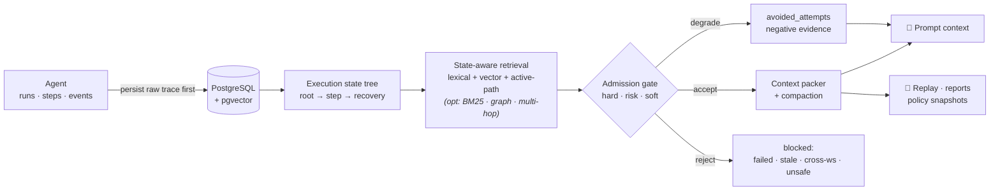
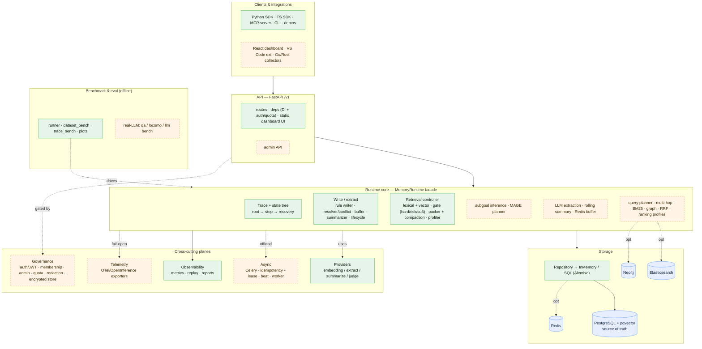
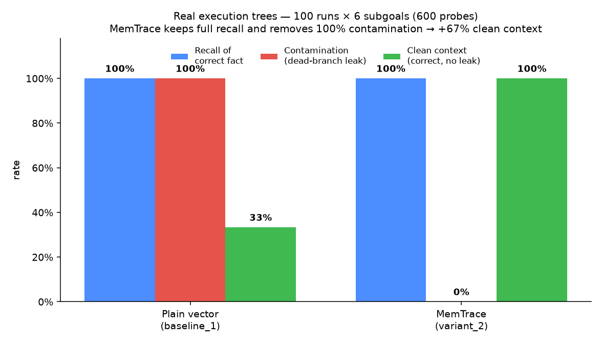
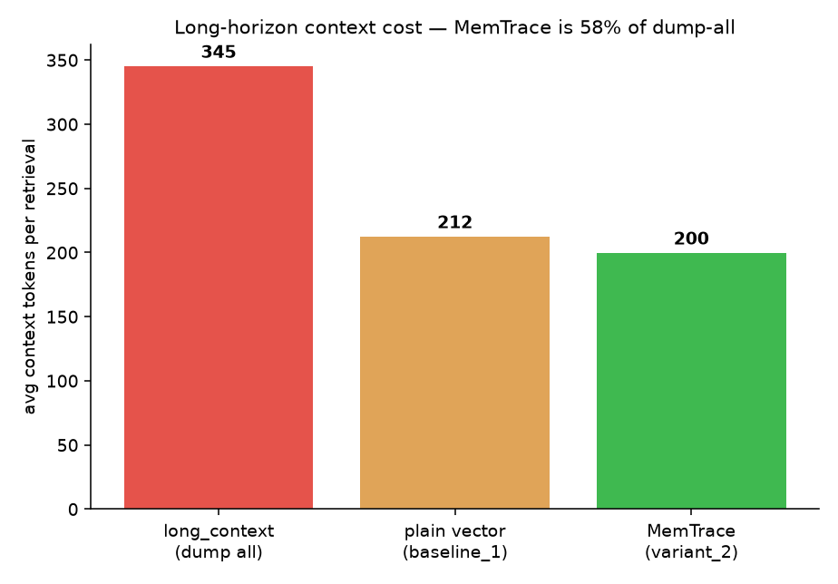
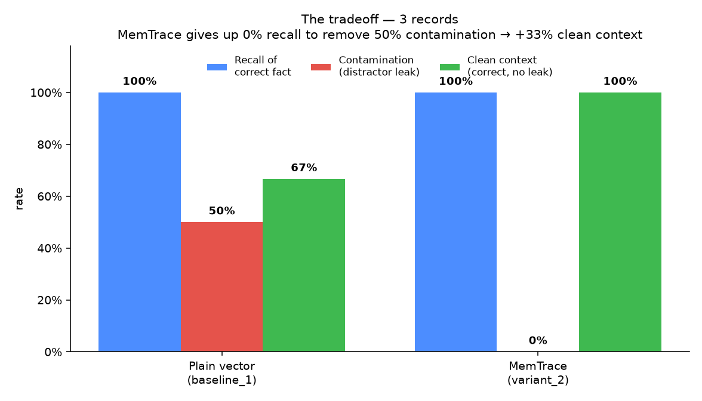
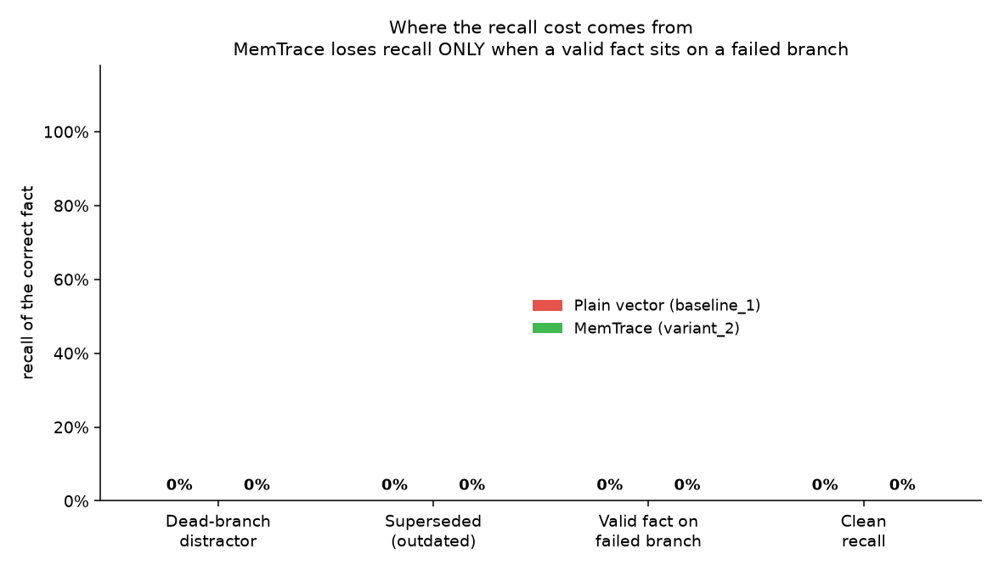

<div align="center">

# 🧭 MemTrace

### A trace-first, state-aware memory runtime for long-horizon agents

Most "agent memory" is a vector store with extra steps. MemTrace treats memory as **runtime infrastructure**: it records what your agent actually did, understands which execution paths are live, and **gates stale, failed, unsafe, or cross-workspace memories before they ever reach the prompt** — and lets you replay every decision.

<p align="center">
  <a href="https://github.com/MicroYui/mem-trace/actions/workflows/ci.yml"></a>
  <a href="https://www.apache.org/licenses/LICENSE-2.0"></a>
  
  
  
  
</p>

<p align="center">
  <a href="#-quickstart-5-minute-no-network-demo"><b>Quickstart</b></a> ·
  <a href="#-why-not-plain-vector-memory"><b>Why</b></a> ·
  <a href="#-how-it-works"><b>How it works</b></a> ·
  <a href="#-system-architecture"><b>Architecture</b></a> ·
  <a href="#-benchmark-snapshot"><b>Benchmark</b></a> ·
  <a href="#-user-docs"><b>Docs</b></a> ·
  <a href="docs/design/ROADMAP.md"><b>Roadmap</b></a>
</p>

</div>

---

> [!NOTE]
> **The 30-second pitch.** An agent tries `npm test`, it fails, the agent recovers with `bun test`. Later, a plain vector store happily retrieves that *failed* `npm test` memory because it's semantically similar — and the agent repeats the mistake. MemTrace knows that memory lives on a **failed branch** and keeps it out of positive context. Same seeded memory, different outcome:
>
> ```text
> baseline_1 action: npm test  (contamination=1)   ← plain vector recall
> variant_2  action: bun test  (contamination=0)   ← MemTrace state-aware + gate
> contamination eliminated: true
> ```

## 🤔 Why not plain vector memory?

Plain vector recall retrieves text that is *semantically* similar but often *operationally* wrong: a failed branch, a rolled-back command, a stale correction, another workspace's preference, or risky tool evidence. MemTrace treats memory as runtime infrastructure instead of a generic RAG store:

| | Plain vector memory | **MemTrace** |
| --- | --- | --- |
| **Unit of memory** | Embedded text chunks | Runs, steps, events, and an execution **state tree** persisted *before* extraction |
| **Retrieval** | Nearest neighbors | State-aware scoring that knows the **active path** |
| **Safety** | None — similarity is the only filter | **Admission gate** rejects/degrades failed, stale, superseded, cross-workspace, secret, destructive, and tool-sensitive memories |
| **Failed attempts** | Re-injected as if valid | Surfaced as warning-only `avoided_attempts`, never as positive instructions |
| **Budget pressure** | Truncate and hope | **Compaction** keeps protected constraints and logs what it dropped |
| **Explainability** | "the embeddings said so" | **Replay** of access logs, gate logs, profiler spans, and policy snapshots |

## ⚙️ How it works



1. **Trace first.** Raw events are persisted before any derived memory extraction — the trace is the source of truth.
2. **State tree.** Runs become a `root → step → recovery` tree, so failed and rolled-back branches are first-class, not lost.
3. **State-aware retrieval.** Candidate scoring blends lexical + deterministic-vector similarity with the live active path — with optional BM25/graph fusion, task-intent ranking profiles, and multi-hop expansion when enabled.
4. **Admission gate.** A three-layer `hard / risk / soft` gate accepts, degrades, or rejects each candidate before prompt use.
5. **Pack & compact.** The packer assembles bounded context, retaining protected constraints under budget pressure.
6. **Replay everything.** Every retrieval is reconstructable from access/gate logs and a policy snapshot that distinguishes data drift from policy drift.

## 🏗️ System architecture

The whole system at a glance — solid = default-on, **dashed = default-off / opt-in**, blue = data stores. Everything dashed is degrade-safe: turn it off (or leave the service/extra absent) and candidate scoring is byte-identical, benchmark stays 16/16. For the exhaustive per-module diagram + the `MEMTRACE_*` flag that enables each optional piece, see [docs/architecture-diagram.md](docs/architecture-diagram.md).



## ✨ What's implemented today

- 🧱 **Core runtime** — `MemoryRuntime` with runs, steps, events, state tree, memory writer/resolver, retrieval controller, admission gate, context packer, profiler, and a full `/v1` FastAPI surface.
- 🗄️ **Storage** — PostgreSQL + pgvector source of truth, plus a deterministic in-memory runtime for tests and no-network demos.
- 🛡️ **Safety & quality** — context compaction, failure-aware negative evidence, retained-negative compaction metadata, replay, JSON/Markdown/HTML reports, and deterministic benchmark acceptance.
- 🔎 **Advanced retrieval** *(optional & default-off — the deterministic lexical+vector path stays the default)* — query planner (entity/keyword hints, need-retrieval skip, query rewrite), multi-hop iterative retrieval, optional Elasticsearch/OpenSearch hybrid BM25, optional Neo4j provenance graph + neighbor expansion, multi-path RRF fusion (lexical + vector + BM25), task-intent ranking profiles, and a multi-store consistency reconciler — each behind a flag, so candidate scoring stays byte-identical (and benchmark/replay unchanged) when off.
- 🌳 **State-tree depth** — full `node_type` vocabulary (`root/subgoal/step/tool_call/recovery/summary`), deterministic subgoal auto-inference, and a MAGE Grow/Compress/Maintain/Revise planner (default-off, read-only analysis; the coordination point for summary-node × lifecycle-decay compression).
- 🔌 **Pluggable providers** — provider registry + controlled memory-key ontology with deterministic defaults and config-gated real providers.
- ⚙️ **Platform & governance** — optional async Redis/Celery, lifecycle/reflection signals, memory versions/conflicts, and default-off multi-tenant governance: API-key **and JWT/OIDC** auth, workspace membership, quota, redaction-state protections, an optional encrypted raw-payload store, a distributed scheduler lease, and Celery beat.
- 🧰 **Integrations** — Python SDK, CLI, LangGraph adapter, TypeScript SDK (`@memtrace/sdk`), MCP server (`@memtrace/mcp-server`), Claude Code / Cursor MCP config templates, a **VS Code extension** (`packages/vscode-extension`), and scale-only **Go trace-collector / Rust profile-analyzer** components.
- 📊 **Observability** — default-off OpenTelemetry/OpenInference-compatible export (noop/JSONL/optional OTLP) and a React/TypeScript dashboard in `apps/web` (Overview, Run Explorer, Access Replay, Benchmark Lab, Memory Atlas, read-only Ops, fixture Showcase).

## 🚀 Quickstart: 5-minute no-network demo

**Prerequisites:** Python 3.12+ and [`uv`](https://docs.astral.sh/uv/). No Docker, no API keys, no network.

```bash
uv sync --extra dev
./scripts/smoke-release-readiness.sh
```

This orchestrates the deterministic in-process CLI demo and the Python SDK example and verifies these stable markers:

```text
baseline_1 action: npm test (contamination=1)
variant_2 action: bun test (contamination=0)
contamination eliminated: true
```

A baseline memory strategy reuses failed `npm test` evidence; MemTrace's state-aware gated strategy chooses `bun test`. Run the pieces individually:

```bash
uv run --package memtrace-sdk memtrace demo --in-process            # CLI demo
uv run --package memtrace-sdk python examples/simple_agent/main.py  # Python SDK example
```

## 📊 Benchmark snapshot

MemTrace is evaluated in four complementary layers — a **real execution-tree benchmark**, a **flat scale run** that surfaces the honest cost, a **deterministic correctness suite**, and **real-LLM checks on real + synthetic data** — all reproducible.

### 1. Real execution-tree benchmark — where MemTrace is built to win

This is the setting a plain vector store structurally cannot represent. `app/benchmark/trace_bench.py` drives the **real `MemoryRuntime`** to build a long-horizon *execution tree* per scenario: a run of many subgoals, where each subgoal may make one or more attempts that **fail and get rolled back** (dead branches) before a **recovery** attempt succeeds. Memories are created by the real write path, so they carry genuine `branch_status` / state-node provenance, and retrieval runs the full pipeline (state tree → active-path filtering → admission gate → compaction). Deterministic, no LLM. Latest run: **120 runs × 10 subgoals = 1,200 probes**.

<p align="center">
  
</p>

| Strategy | Recall | Contamination | Clean context |
| --- | --- | --- | --- |
| `baseline_1` — plain vector | 100% | **100%** | 33% |
| `variant_2` — **MemTrace** | 100% | **0%** | **100%** |

Every dead-branch fact the run abandoned leaks into a plain-vector store; MemTrace isolates **all** of them while keeping full recall of the current, active-path answer — so clean context goes **33% → 100%**. And over a long horizon, dumping everything (`long_context`) bloats the prompt while MemTrace stays compact:

<p align="center">
  
</p>

```bash
uv run python -m app.benchmark.trace_bench --scenarios 120 --subgoals 10 --output-dir reports
```

### 2. Flat scale run — and the honest cost

A deterministic **3,000-record** run (`app/benchmark/dataset_bench.py`) isolates the mechanism *and its cost*. It's not a one-sided win: MemTrace's gate removes ~79% contamination plain vector admits, but the *same* isolation over-drops the ~15% of correct facts that happen to sit on a failed branch. Net, it nearly doubles clean context (45% → 85%):

<p align="center">
  
  
</p>

<sub>The recall cost comes from *exactly one* honest category (a valid fact stuck on a failed branch), nowhere else — in the tree benchmark above, correct facts are always on the recovered/active path, so there's no cost. Synthetic but deterministic; retrieval uses the lexical/deterministic vector. Reproduce:</sub>

```bash
uv run python -m app.benchmark.generate_dataset --count 3000 --out /tmp/scale.jsonl
uv run python -m app.benchmark.dataset_bench --dataset /tmp/scale.jsonl --strategies all --output-dir reports
uv run --with matplotlib python -m app.benchmark.plot_benchmarks   # regenerates docs/assets/*.png
```

### 3. Deterministic correctness — 16 cases × 6 strategies

```bash
uv run python -m app.benchmark.runner --output-dir reports   # acceptance: passed=true (16/16)
./scripts/reproduce.sh                                        # full reproduce bundle
```

The six strategies (`baseline_0`, `long_context`, `baseline_1`, `variant_1`, `variant_2`, `variant_3`) quantify each mechanism's contribution across failed-branch isolation, tool safety, compaction, safe negative evidence, sanitized destructive failures, reflection-lite retention, retained-negative metadata, and LoCoMo/MemoryArena-style long-horizon / temporal-update / multi-hop recall. Current acceptance: **16/16**.

### 4. Real-LLM checks (real + synthetic data)

Layers 1–3 are deterministic and marker-scored. These close the loop against an **actual model** (`gpt-5.4` via a local OpenAI-compatible proxy).

**Real public dataset — LoCoMo** (`app/benchmark/locomo_bench.py`): seeds real long-conversation turns as memory, answers a 30-question sample under three conditions with a real LLM answering + a real LLM judge grading against gold answers.

| Condition | Accuracy |
| --- | --- |
| no memory (`baseline_0`) | **0%** |
| plain vector (`baseline_1`) | **30%** |
| MemTrace (`variant_2`) | **30%** |

<sub>Honest read: memory clearly helps (0% → 30%), and **MemTrace ties plain vector here** — LoCoMo is *conversational* (long-horizon recall / temporal reasoning), so it doesn't contain the **dead execution branches** that MemTrace's gate is built to isolate; that agentic edge is what layer 1 measures. Absolute accuracy is modest because retrieval uses lexical/deterministic vectors (this environment has no real embedding endpoint). Not a leaderboard submission. Requires a downloaded `locomo10.json` + an LLM endpoint.</sub>

**Synthetic Q&A** (`app/benchmark/qa_bench.py`): on 4 agentic scenarios the gated-memory answer is correct only *with* MemTrace context — **4/4** (`bun test` not `npm`; `/api/v2/users` not `v1`; `Bun·pnpm·Postgres`), vs *"I do not have that information."* with no memory.

```bash
MEMTRACE_LLM_API_KEY=... MEMTRACE_LLM_BASE_URL=http://localhost:4141/v1 MEMTRACE_LLM_MODEL=gpt-5.4 \
  uv run python -m app.benchmark.qa_bench --output-dir reports
# real dataset (download locomo10.json first):
MEMTRACE_LLM_API_KEY=... MEMTRACE_LLM_MODEL=gpt-5.4 MEMTRACE_LOCOMO_PATH=locomo10.json \
  uv run python -m app.benchmark.locomo_bench --limit 30 --output-dir reports
```


**Real public dataset — LoCoMo** (`app/benchmark/locomo_bench.py`): seeds real long-conversation turns as memory, answers a 30-question sample under three conditions with a real LLM answering + a real LLM judge grading against gold answers.

| Condition | Accuracy |
| --- | --- |
| no memory (`baseline_0`) | **0%** |
| plain vector (`baseline_1`) | **30%** |
| MemTrace (`variant_2`) | **30%** |

<sub>Honest read: memory clearly helps (0% → 30%), and **MemTrace ties plain vector here** — LoCoMo is *conversational* (long-horizon recall / temporal reasoning), so it doesn't contain the **dead execution branches** that MemTrace's gate is built to isolate; that agentic edge is what layer 1 measures. Absolute accuracy is modest because retrieval uses lexical/deterministic vectors (this environment has no real embedding endpoint). Not a leaderboard submission. Requires a downloaded `locomo10.json` + an LLM endpoint.</sub>

**Synthetic Q&A** (`app/benchmark/qa_bench.py`): on 4 agentic scenarios the gated-memory answer is correct only *with* MemTrace context — **4/4** (`bun test` not `npm`; `/api/v2/users` not `v1`; `Bun·pnpm·Postgres`), vs *"I do not have that information."* with no memory.

```bash
MEMTRACE_LLM_API_KEY=... MEMTRACE_LLM_BASE_URL=http://localhost:4141/v1 MEMTRACE_LLM_MODEL=gpt-5.4 \
  uv run python -m app.benchmark.qa_bench --output-dir reports
# real dataset (download locomo10.json first):
MEMTRACE_LLM_API_KEY=... MEMTRACE_LLM_MODEL=gpt-5.4 MEMTRACE_LOCOMO_PATH=locomo10.json \
  uv run python -m app.benchmark.locomo_bench --limit 30 --output-dir reports
```


## 🧭 Quickstart paths

| Path | Command | Runtime requirement | Stable marker / expected result |
| --- | --- | --- | --- |
| CLI in-process demo | `uv run --package memtrace-sdk memtrace demo --in-process` | Default/no-network | Prints `baseline_1 action: npm test`, `variant_2 action: bun test`, `contamination eliminated: true` |
| Python SDK example | `uv run --package memtrace-sdk python examples/simple_agent/main.py` | Default/no-network | Prints the same failed-branch contrast markers |
| Release-readiness smoke | `./scripts/smoke-release-readiness.sh` | Default/no-network; optional HTTP/TS checks are env-gated | Verifies the CLI and Python SDK demo markers; prints `release readiness smoke passed` |
| Deterministic benchmark | `uv run python -m app.benchmark.runner --output-dir reports` | Default/no-network | Writes ignored files under `reports/`; acceptance should be `passed=true` |
| Full reproducibility bundle | `./scripts/reproduce.sh` | Default/no-network | Runs demo, benchmark, reports, and acceptance checks |
| Local HTTP service | See [Local HTTP and Docker path](#-local-http-and-docker-path) below | Docker/PostgreSQL required | Waits for PostgreSQL health before Alembic, then `curl http://localhost:8000/health` returns service health |
| CLI HTTP demo | `uv run --package memtrace-sdk memtrace --http http://127.0.0.1:8000 demo` | Local service required | Same high-level failed-branch contrast, persisted through `/v1` |
| TypeScript SDK example | `npm exec --yes --package bun -- bun examples/ts-simple-agent/src/index.ts` | Local service required; set `MEMTRACE_BASE_URL` if not `http://127.0.0.1:8000` | Emits JSON with `run_id`, `step_id`, `event_id`, `access_id`, and `context_block_count` |
| MCP server | `npm exec --yes --package bun -- bun packages/mcp-server/src/server.ts` | Local service required; MCP client launches stdio server | Tool results are redacted and replay/report output is capped |
| Web dashboard fixture mode | `npm exec --yes --package bun -- bun run web:dev` | Default/no live API needed after JS deps are installed | Open `/showcase`, `/memories`, `/ops`, `/benchmark`, `/runs/run_showcase_bun_recovery`, or `/access/acc_showcase_gate` |

If Bun is installed globally, replace `npm exec --yes --package bun -- bun ...` with `bun ...`. The repository uses `bun.lock`; npm/pnpm/yarn lockfiles should not be added.

## 🐳 Local HTTP and Docker path

The default quickstart does not require Docker. To run the SQL-backed API path:

```bash
docker-compose up -d
until docker inspect --format='{{.State.Health.Status}}' memtrace-postgres | grep -q healthy; do sleep 1; done
uv run alembic upgrade head
uv run uvicorn app.main:app --app-dir apps/api --reload
curl http://localhost:8000/health
```

The compose file uses `pgvector/pgvector:pg16` on host port `5433`. Existing PG15 volumes are not compatible with the PG16 image; switching images may require removing the old volume.

Optional Redis/Celery development services are in `docker-compose.dev.yml` and are not required for default demos, tests, or benchmark runs:

```bash
docker-compose -f docker-compose.yml -f docker-compose.dev.yml up -d
MEMTRACE_ASYNC_TASKS_ENABLED=true \
MEMTRACE_REDIS_URL=redis://localhost:6379/0 \
MEMTRACE_CELERY_BROKER_URL=redis://localhost:6379/1 \
MEMTRACE_CELERY_RESULT_BACKEND=redis://localhost:6379/2 \
MEMTRACE_CELERY_TASK_ALWAYS_EAGER=false \
uv run uvicorn app.main:app --app-dir apps/api --reload
```

## 🧰 TypeScript SDK and MCP

`@memtrace/sdk` is a thin fetch client over `/v1`. `@memtrace/mcp-server` is a stdio MCP adapter over that SDK; it does not import Python runtime or database modules and does not reimplement retrieval, gate, replay, or packing semantics.

For MCP clients, set service configuration in the environment rather than inline secrets:

```bash
export MEMTRACE_BASE_URL="http://127.0.0.1:8000"
export MEMTRACE_API_KEY="your-dev-token-if-auth-is-enabled"
```

Checked-in local-development templates:

- Claude Code-style: [`examples/mcp/claude-code.json`](examples/mcp/claude-code.json)
- Cursor-style: [`examples/mcp/cursor.json`](examples/mcp/cursor.json)

Both templates launch `bun packages/mcp-server/src/server.ts` relative to the repository root and therefore require `bun` to be available on the MCP client's `PATH`. If your MCP client launches from another directory, replace that path with an absolute path or an installed package command. If Bun is not globally available to the client, configure an absolute Bun executable path or wait for the future installed `memtrace-mcp-server` command after package publishing is explicitly approved. If your client does not expand `${MEMTRACE_BASE_URL}` / `${MEMTRACE_API_KEY}`, render or replace those values outside version control.

Available MCP tools: `memtrace_start_run`, `memtrace_start_step`, `memtrace_write_event`, `memtrace_retrieve_context`, `memtrace_inspect_access`, `memtrace_finish_step`, `memtrace_replay_access`, and `memtrace_report`.

A thin **VS Code extension** lives in [`packages/vscode-extension`](packages/vscode-extension). It calls `/v1` through `@memtrace/sdk` and contributes the `MemTrace: Retrieve Context`, `Show Run Timeline`, and `Inspect Access` commands, reading `memtrace.baseUrl` / `memtrace.apiKey` (secrets prefer the `MEMTRACE_API_KEY` environment variable). Like the MCP server, it never reimplements runtime semantics — it is excluded from the default build and requires `@types/vscode` + a VS Code extension host to develop.

## 🧪 Optional advanced retrieval (default-off)

The default retrieval path is deterministic lexical + vector scoring. Every advanced retrieval mechanism is gated behind an environment flag and leaves candidate scoring byte-identical (and benchmark/replay unchanged) when off:

| Capability | Flag | Notes |
| --- | --- | --- |
| Query planner (hints / rewrite / need-retrieval) | `MEMTRACE_RETRIEVAL_QUERY_PLANNER=off\|hints\|full` | No model / network; deterministic |
| Multi-hop iterative retrieval | `MEMTRACE_RETRIEVAL_MULTI_HOP_HOPS=0..4` | Budget-bounded entity-cue expansion — [guide + demo](docs/advanced-retrieval-multi-hop.md) |
| Hybrid BM25 backend | `MEMTRACE_RETRIEVAL_HYBRID_BACKEND=off\|inmemory\|elasticsearch\|opensearch` | ES/OpenSearch via the optional `search` extra; degrades cleanly |
| Provenance-graph neighbor expansion | `MEMTRACE_RETRIEVAL_GRAPH_BACKEND=off\|inmemory\|neo4j` | Neo4j via the optional `graph` extra; lifecycle filter preserved |
| Multi-path fusion | `MEMTRACE_RETRIEVAL_FUSION=linear\|rrf` | RRF fuses lexical + vector + BM25 |
| Task-intent ranking profiles | `MEMTRACE_RETRIEVAL_RANKING_PROFILES_ENABLED=true` | Deterministic per-memory-type re-weighting |
| Secondary-index consistency | `reindex_secondary` maintenance op | Reconciles ES/Neo4j toward PostgreSQL |

The `inmemory` hybrid/graph modes run deterministic in-process BM25 / provenance-graph BFS with **zero external services**. For the real Elasticsearch / Neo4j backends, `docker-compose.full.yml` ships the services: `uv sync --extra search --extra graph`, `docker-compose -f docker-compose.yml -f docker-compose.full.yml up -d`, then `./scripts/smoke-advanced-backends.sh` to verify end-to-end. See [deployment notes](docs/deployment.md#full-tier--external-advanced-retrieval-backends).

Governance is likewise default-off: JWT/OIDC auth (`MEMTRACE_JWT_AUTH_ENABLED`, HS256 native, RS256/ES256 via the optional `jwt` extra), a workspace membership table, a distributed scheduler lease (`MEMTRACE_SCHEDULER_LEASE_BACKEND`), Celery beat (`MEMTRACE_CELERY_BEAT_ENABLED`), and an encrypted raw-payload store (optional `crypto` extra). See [deployment notes](docs/deployment.md).

## 📡 Telemetry export

Telemetry is disabled/noop by default. To write local no-network JSONL spans while using the HTTP service, opt in explicitly:

```bash
MEMTRACE_TELEMETRY_ENABLED=true \
MEMTRACE_TELEMETRY_EXPORTER=jsonl \
MEMTRACE_TELEMETRY_JSONL_PATH=reports/telemetry.jsonl \
uv run uvicorn app.main:app --app-dir apps/api --reload
```

Runtime hooks export redacted terminal run/step snapshots plus event and retrieval spans after authoritative persistence succeeds. You can also request a read-only run projection; the response contains counts and warnings, not raw spans:

```bash
curl -X POST http://127.0.0.1:8000/v1/telemetry/export/runs/<run_id> \
  -H 'Content-Type: application/json' \
  -d '{"include_steps":true,"include_events":true}'
```

OTLP export is optional and requires installing the `telemetry` extra plus an HTTP(S) endpoint without embedded credentials. LangSmith, Phoenix, and Langfuse are possible external OTLP/OpenInference destinations when configured outside MemTrace; this repository does not include vendor-specific SDK bridges. A CLI telemetry-export command is intentionally deferred; use runtime JSONL settings or the HTTP endpoint.

## 🔁 Benchmark and reproducibility

Run only the deterministic benchmark:

```bash
uv run python -m app.benchmark.runner --output-dir reports
```

Run the full deterministic reproduce bundle:

```bash
./scripts/reproduce.sh
```

The reproduce script is a wrapper around the same deterministic entrypoints, which can also be run directly when debugging report generation:

```bash
uv run python -m app.demo.run_demo --out reports
uv run python -m app.benchmark.runner --output-dir reports
uv run python -m app.observability.reports --output-dir reports
```

Beyond the deterministic suite, two opt-in benches validate real-world effectiveness without affecting default reproducibility:

- **Real-LLM Q&A bench** (`app/benchmark/qa_bench.py`) — asks a real LLM the same question with no-memory vs gated context; env-gated, skips cleanly with no endpoint.
- **Dataset-driven recall bench** (`app/benchmark/dataset_bench.py`) — ingests LoCoMo/MemoryArena-style JSONL and quantifies MemTrace vs plain-vector recall + distractor leakage; ships a built-in sample, accepts larger datasets via `--dataset` / `MEMTRACE_DATASET_PATH`.

Replay data is also available through the HTTP API, including `/v1/replay/access/{access_id}` when the local service is running.

## 🖥️ Web dashboard

The full dashboard lives in `apps/web` and is separate from the built-in static viewer. It is a React/Vite/TypeScript app over `@memtrace/sdk` and existing read-only `/v1` APIs. Fixture mode works without a running API:

```bash
npm exec --yes --package bun -- bun run web:dev
```

Open `http://127.0.0.1:5173/showcase` for the guided sample-data walkthrough. The fixture-backed routes include Overview, Run Explorer, Access Replay, Benchmark Lab, Memory Atlas, and read-only Ops panels. API keys are entered only for live mode and are sent as headers, not URLs.

To connect to a live local service, start the HTTP path above, then use the dashboard connection form with an optional workspace id and API key. `VITE_MEMTRACE_API_BASE_URL` defaults to same-origin `/v1`; local Vite dev uses a `/v1` proxy to `http://localhost:8000` unless you configure a direct API origin.

To build static assets:

```bash
npm exec --yes --package bun -- bun run web:build
```

Optional screenshot workflow, writing PNGs under `/tmp` by default:

```bash
MEMTRACE_WEB_SCREENSHOT_URL=http://127.0.0.1:5173 \
npm exec --yes --package playwright -- node apps/web/scripts/capture-showcase-screenshots.mjs
```

When the HTTP service is running you can also open the built-in read-only static **Dashboard UI** at `/v1/dashboard/ui`. It is a single self-contained HTML page (no build step, no external JS/CDN) that calls `/v1/dashboard/tables` and `/v1/observability/summary` from the browser to show runs, access logs, profiler events, the observability summary, and per-strategy benchmark metrics. If auth is enabled, paste the token into the page's token field (sent as `Authorization: Bearer` / `X-API-Key`). This viewer is intentionally not the React/TypeScript `apps/web` dashboard.

Generated report artifacts are intentionally ignored by git and can be regenerated:

- `reports/demo_report.{md,json}`
- `reports/benchmark_report.md`
- `reports/benchmark_results.json`
- `reports/observability_report.{json,md,html}`

## 📚 User docs

- [Getting started](docs/getting-started.md): prerequisites, no-network demos, HTTP path, TypeScript example, troubleshooting.
- [Concepts](docs/concepts.md): runs, steps, events, state tree, memories, gate, negative evidence, compaction, lifecycle, governance defaults, telemetry export boundaries.
- [MCP integration](docs/mcp.md): server behavior, templates, placeholders, local path assumptions, redaction/capping.
- [Benchmark guide](docs/benchmark.md): strategies, cases, commands, the dataset-driven bench schema, and metric interpretation.
- [Deployment notes](docs/deployment.md): PostgreSQL, optional Redis/Celery, auth/governance/quota defaults, provider config, safety posture.
- [Release checklist](docs/release-checklist.md): maintainer verification, package dry-run checks, artifact hygiene, publish decision gates, and rollback notes.
- [Why agent memory is not just RAG](docs/blog/why-agent-memory-is-not-just-rag.md): narrative overview.

Internal design and historical implementation plans live under [`docs/design/`](docs/design/). New users should not need to read them before running the quickstarts.

## ✅ Local verification

```bash
./scripts/smoke.sh                      # common smoke bundle
./scripts/smoke-release-readiness.sh    # lighter canonical public-adoption smoke
```

Optional live-service checks can be enabled explicitly:

```bash
MEMTRACE_SMOKE_HTTP_URL=http://127.0.0.1:8000 ./scripts/smoke-release-readiness.sh
MEMTRACE_SMOKE_TS=1 MEMTRACE_BASE_URL=http://127.0.0.1:8000 ./scripts/smoke-release-readiness.sh
```

Or run pieces directly:

```bash
uv run --extra dev pytest -q
uv run --extra dev python -m compileall -q apps/api/app packages/python-sdk/src examples
npm exec --yes --package bun -- bun run typecheck
npm exec --yes --package bun -- bun test
./scripts/reproduce.sh
```

Default local/dev/benchmark behavior keeps auth, quotas, Redis/Celery, live PostgreSQL integration tests, and real LLM/provider calls disabled unless you opt in with environment variables.

## 🗺️ Roadmap

The completed MVP, observability, compaction, failure-aware negative evidence, SDK/CLI/LangGraph, six-strategy benchmark, security/consistency hardening, provider registry/key ontology, Phase 4 platform foundations, TypeScript SDK, MCP server, release-readiness work, the OpenTelemetry/OpenInference exporter, and the React/TypeScript dashboard are tracked in [`docs/design/ROADMAP.md`](docs/design/ROADMAP.md).

The previously-deferred advanced backlog is now **implemented as default-off, degrade-safe capabilities**: Elasticsearch/OpenSearch hybrid retrieval, Neo4j provenance graph + neighbor expansion, multi-path RRF fusion, the full query planner, multi-hop retrieval, task-intent ranking profiles, multi-store consistency, the extended state-tree node types + subgoal inference + MAGE operations, full multi-tenant governance (JWT/OIDC, workspace membership, distributed scheduler lease, Celery beat, encrypted payload store), a VS Code extension, and scale-only Go/Rust components. The deterministic default path is unchanged (benchmark/reproduce stay 16/16) and PostgreSQL remains the source of truth. A built-in read-only static Dashboard UI is available at `/v1/dashboard/ui`; the richer interactive React/TypeScript dashboard lives in `apps/web`.

Explicitly **out of scope** (see the roadmap's §8): a full LoCoMo/MemoryArena leaderboard, multimodal ingestion, a full knowledge-graph frontend, a trained MemGate model, and a multi-agent platform.

## 📄 License

[Apache 2.0](https://www.apache.org/licenses/LICENSE-2.0).
