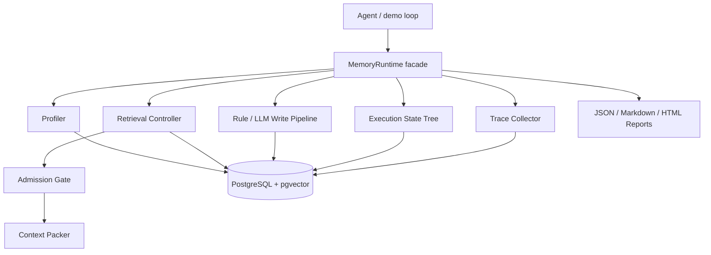

# MemTrace

MemTrace is a state-aware memory runtime and profiler for long-horizon LLM agents. It records agent traces, builds an execution state tree, writes structured memories, retrieves context with state awareness, gates unsafe or stale memories before prompt injection, and reports every retrieval decision.

## Why MemTrace

Vector memory alone can recall the wrong thing at the wrong time: a failed branch, another workspace's preference, stale endpoint guidance, or risky tool evidence. MemTrace treats memory as runtime infrastructure rather than a generic RAG store:

- **Trace first:** raw runs, steps, and events are persisted before memory extraction.
- **State-aware retrieval:** active execution paths influence candidate selection and scoring.
- **Admission gate:** failed/rolled-back, stale, superseded, cross-workspace, secret, and risky memories are rejected or degraded before context packing.
- **Replayable observability:** access logs, gate logs, profiler events, and replay APIs explain why a memory entered or missed the prompt.

## Architecture



## Quickstart: deterministic reproducibility baseline

Prerequisites:

- Python 3.12+
- [uv](https://docs.astral.sh/uv/)

Install dependencies and generate all deterministic showcase reports:

```bash
uv sync --extra dev
./scripts/reproduce.sh
```

The script runs these entrypoints:

```bash
uv run python -m app.demo.run_demo --out reports
uv run python -m app.benchmark.runner --output-dir reports
uv run python -m app.observability.reports --output-dir reports
```

Generated artifacts are ignored by git and can be regenerated at any time:

- `reports/demo_report.md`
- `reports/demo_report.json`
- `reports/benchmark_report.md`
- `reports/benchmark_results.json`
- `reports/observability_report.json`
- `reports/observability_report.md`
- `reports/observability_report.html`

The deterministic benchmark passes only when `reports/benchmark_results.json` contains `acceptance.passed=true`.

## What the demo proves

The canonical demo is Bun vs Node.js with failed-branch isolation:

1. The user states that the project uses Bun, not Node.js.
2. A failed branch tries `npm test` and is rolled back.
3. A recovery step asks how to run tests.
4. `baseline_1` recalls the failed `npm test` evidence and is contaminated.
5. `variant_2` uses state-aware retrieval plus the gate, rejects the rolled-back branch, and chooses `bun test`.

Run only the demo:

```bash
uv run python -m app.demo.run_demo --out reports
```

## Benchmark variants

Run only the deterministic benchmark:

```bash
uv run python -m app.benchmark.runner --output-dir reports
```

Strategies:

- `baseline_0`: no memory.
- `baseline_1`: vector/lexical memory without state-aware isolation or admission gate.
- `variant_1`: state-aware retrieval.
- `variant_2`: state-aware retrieval plus admission gate.

The benchmark covers project preference, failed-branch isolation, workspace isolation, tool-call safety, explicit correction, completed-run reuse, stale rejection, no-memory failure recovery, and over-budget context compaction retention.

## Observability and replay

Generate a static observability report fixture:

```bash
uv run python -m app.observability.reports --output-dir reports
```

The runtime also exposes observability APIs when served through FastAPI:

- `GET /health`
- `POST /v1/context/retrieve`
- `GET /v1/access/{access_id}`
- `GET /v1/replay/access/{access_id}`
- `GET /v1/replay/runs/{run_id}`
- `GET /v1/observability/summary`
- `POST /v1/observability/reports`
- `GET /v1/dashboard/tables`

## Context compaction

When retrieval exceeds the token budget, MemTrace does not silently discard low-priority context. It emits protected `compacted_constraints` / `compaction_notice` blocks, persists each `ContextCompactionLog`, includes compaction metrics in observability summaries, surfaces retained facts in JSON/Markdown/HTML reports, and lets replay flag `compaction_drift` if a later rerun would compact differently. The deterministic benchmark includes `case_9_over_budget_compaction`, which checks constraint retention and unsafe-compaction leakage rather than relying on compression ratio alone.

## Three entrypoints: Python SDK / HTTP / CLI

Phase 3.5 adds an installable Python SDK and proves the same runtime behavior is reachable from three entrypoints: an embedded in-process backend, the FastAPI `/v1` HTTP API, and the `memtrace` CLI. All paths go through `MemoryRuntime`, so state-aware retrieval, admission gating, context compaction, negative evidence, profiler logs, and replay semantics stay shared.

### Python SDK quickstart

```python
from memtrace_sdk import MemTrace
from memtrace_sdk.types import EventRole, EventType, StartRunRequest, StartStepRequest, WriteEventRequest

client = MemTrace.in_memory(default_workspace_id="ws_demo")
run = await client.start_run(StartRunRequest(session_id="demo-session", task="remember project facts"))
step = await client.start_step(StartStepRequest(run_id=run.run_id, intent="record preference"))
await client.write_event(
    WriteEventRequest(
        run_id=run.run_id,
        step_id=step.step_id,
        role=EventRole.user,
        event_type=EventType.message,
        content="This project uses Bun, not Node.js",
    )
)
```

Use `MemTrace.in_memory(...)` for deterministic local demos/tests, or wrap an existing runtime with `MemTrace.in_process(runtime)`.

### HTTP backend

Start the API server as shown below, then point the same SDK facade at it:

```python
from memtrace_sdk import MemTrace

client = MemTrace.http("http://localhost:8000", api_key="optional-future-token")
```

The HTTP backend mirrors the `/v1` surface and maps HTTP `404`/`400` responses to SDK `NotFoundError` / `BadRequestError`. It also preserves backend isomorphism for list-shaped reads such as timeline, state tree, steps, profile, and memories.

### LangGraph adapter

`MemTraceLangGraphAdapter` provides framework-light lifecycle hooks without requiring `langgraph` at SDK import time:

```python
from memtrace_sdk import MemTrace, MemTraceLangGraphAdapter

client = MemTrace.in_memory(default_workspace_id="ws_graph")
adapter = MemTraceLangGraphAdapter(client, run_id=run.run_id)

step, context = await adapter.before_node("planner", "How should I run tests?")
write_result, finish_result = await adapter.after_node(step.step_id, content="Use bun test")
```

See [`examples/langgraph_adapter`](examples/langgraph_adapter) for a minimal graph that runs when LangGraph is installed and skips cleanly otherwise.

### CLI

Run the one-shot deterministic CLI demo:

```bash
uv run --package memtrace-sdk memtrace demo --in-process
```

Operational CLI commands require `--http` because each shell invocation is a new process and cannot share throwaway in-memory state:

```bash
uv run --package memtrace-sdk memtrace --http http://localhost:8000 start-run --session-id demo --task "trace my agent"
uv run --package memtrace-sdk memtrace --http http://localhost:8000 retrieve --run-id <run_id> --query "How do I run tests?" --json
```

For runnable end-to-end examples, start with [`examples/README.md`](examples/README.md), [`examples/simple_agent`](examples/simple_agent), and [`examples/langgraph_adapter`](examples/langgraph_adapter).

## Optional PostgreSQL + API mode

The deterministic quickstart above does not require Docker. To explore the SQL-backed runtime, start pgvector PostgreSQL with `docker-compose.yml`:

```bash
docker-compose up -d
uv run alembic upgrade head
uv run uvicorn app.main:app --app-dir apps/api --reload
```

Then check:

```bash
curl http://localhost:8000/health
```

The compose file uses `pgvector/pgvector:pg16` on host port `5433`. Existing PG15 volumes are not compatible with the PG16 image; switching images may require removing the old volume.

## Optional real LLM validation bench

The real LLM bench is manual and opt-in because it requires network access and a live OpenAI-compatible API key:

```bash
MEMTRACE_LLM_API_KEY=... \
MEMTRACE_LLM_BASE_URL=https://ark.cn-beijing.volces.com/api/v3 \
MEMTRACE_LLM_MODEL=deepseek-v4-pro-260425 \
uv run python -m app.benchmark.llm_bench --output-dir reports
```

It writes `reports/llm_bench_report.json` and `reports/llm_bench_report.md`.

## Local verification

Run the full local smoke bundle:

```bash
./scripts/smoke.sh
```

Or run the pieces directly:

```bash
uv run pytest -q
./scripts/reproduce.sh
uv run python -m app.benchmark.runner --output-dir reports
```

## Roadmap

The completed MVP, Phase 3-A observability work, Context Compaction C0-C5, Failure-aware Negative Memory Injection I1-I6, Phase 3.5 SDK/LangGraph adapter/CLI work, and future priorities are tracked in [`docs/design/ROADMAP.md`](docs/design/ROADMAP.md). For a narrative overview of the core idea, read [`docs/blog/why-agent-memory-is-not-just-rag.md`](docs/blog/why-agent-memory-is-not-just-rag.md). Current recommended next areas are expanded 6-strategy benchmarks and provider/key-ontology work.
