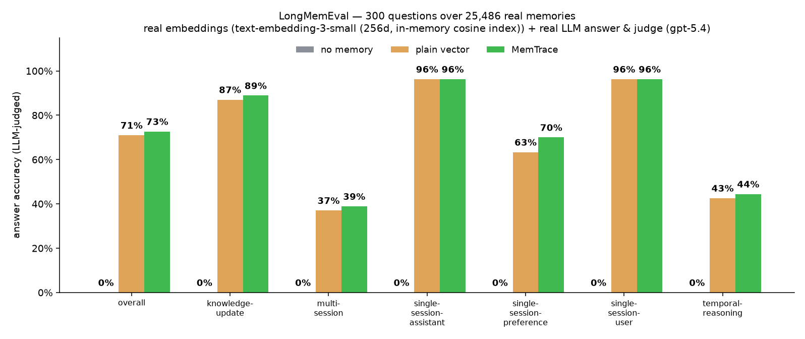
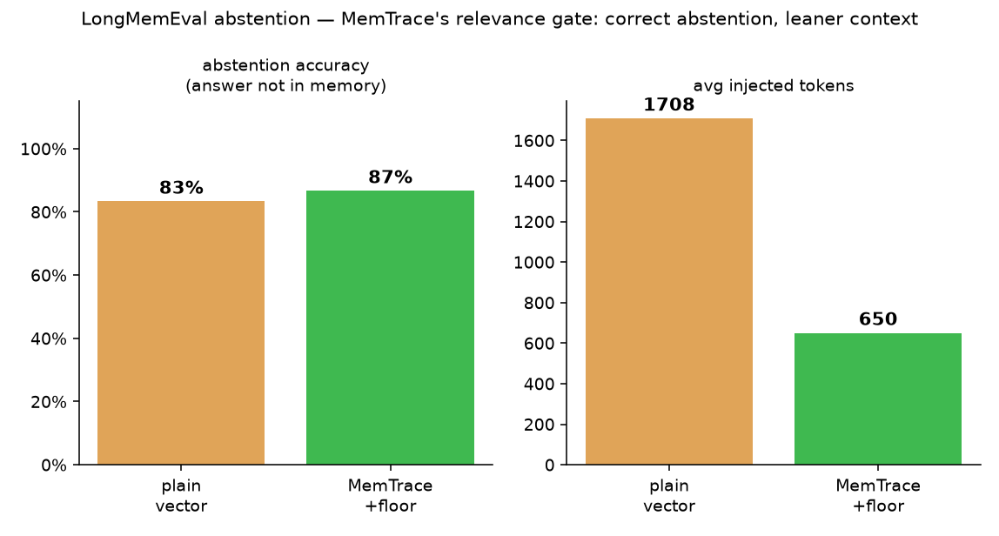
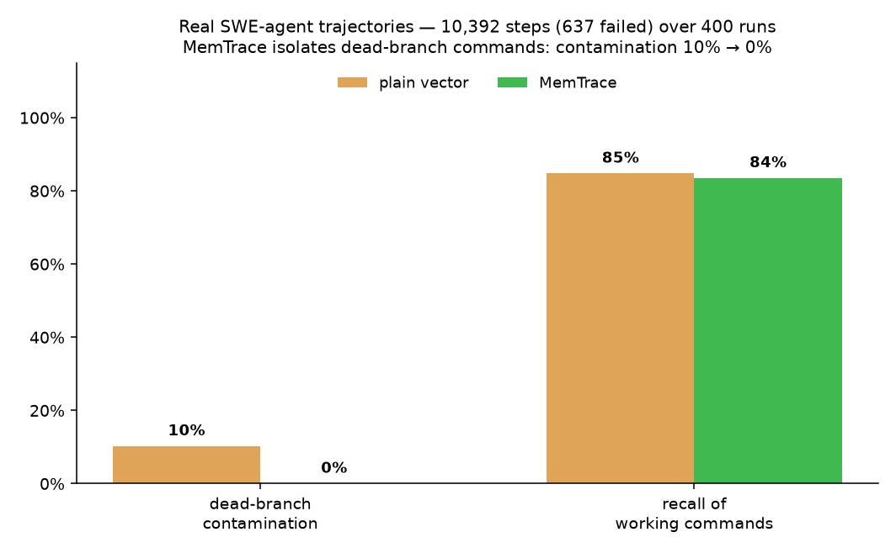
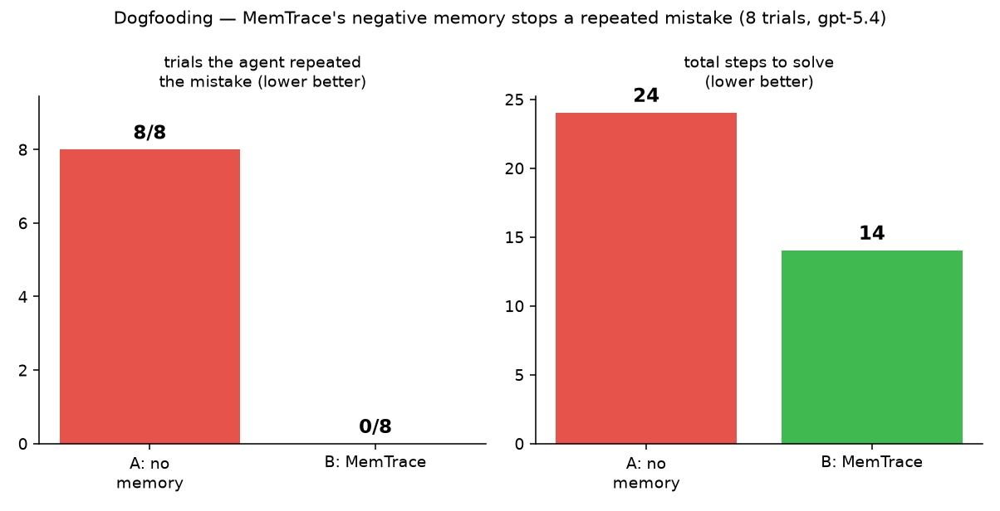
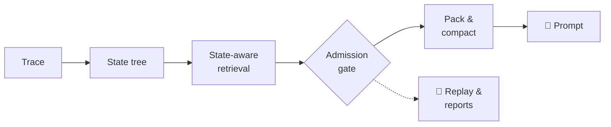

<div align="center">

# 🧭 MemTrace

### A trace-first, state-aware memory runtime for long-horizon agents

Most "agent memory" is a vector store with extra steps. **MemTrace treats memory as runtime infrastructure**: it records what your agent actually did, understands which execution paths are still live, and **gates stale, failed, unsafe, or cross-workspace memories before they ever reach the prompt** — then lets you replay every decision.

<p align="center">
  <a href="https://github.com/MicroYui/mem-trace/actions/workflows/ci.yml"></a>
  <a href="https://www.apache.org/licenses/LICENSE-2.0"></a>
  
  
  
  
</p>

<p align="center">
  <a href="#-quickstart"><b>Quickstart</b></a> ·
  <a href="#-why-not-plain-vector-memory"><b>Why</b></a> ·
  <a href="#-the-evidence"><b>Benchmarks</b></a> ·
  <a href="#-how-it-works"><b>How it works</b></a> ·
  <a href="#-integrations"><b>Integrations</b></a> ·
  <a href="#-docs"><b>Docs</b></a> ·
  <a href="docs/design/ROADMAP.md"><b>Roadmap</b></a>
</p>

</div>

---

## ⚡ The 30-second pitch

An agent tries `npm test`, it fails, the agent recovers with `bun test`. Later, a plain vector store happily retrieves that **failed** `npm test` memory because it is semantically similar — and the agent repeats the mistake.

MemTrace knows that memory lives on a **failed branch** and keeps it out of positive context. Same seeded memory, different outcome:

```text
baseline_1 action: npm test  (contamination=1)   ← plain vector recall
variant_2  action: bun test  (contamination=0)   ← MemTrace state-aware + gate
contamination eliminated: true
```

That failed-branch contamination is not an edge case — it is the default failure mode of similarity-only memory on any agent that recovers, rolls back, or corrects itself. **Memory is where long-horizon agents accumulate their mistakes; MemTrace is the runtime that stops replaying them.**

## 🤔 Why not plain vector memory?

Plain vector recall retrieves text that is *semantically* similar but often *operationally* wrong: a failed branch, a rolled-back command, a stale correction, another workspace's preference, or risky tool evidence. MemTrace treats memory as runtime infrastructure instead of a generic RAG store:

| | Plain vector memory | **MemTrace** |
| --- | --- | --- |
| **Unit of memory** | Embedded text chunks | Runs, steps, events, and an execution **state tree** persisted *before* extraction |
| **Retrieval** | Nearest neighbors | State-aware scoring that knows the **active path** |
| **Safety** | None — similarity is the only filter | **Admission gate** rejects/degrades failed, stale, superseded, cross-workspace, secret, destructive, and tool-sensitive memories |
| **Failed attempts** | Re-injected as if valid | Surfaced as warning-only `avoided_attempts`, never as positive instructions |
| **Budget pressure** | Truncate and hope | **Compaction** keeps protected constraints and logs what it dropped |
| **Explainability** | "the embeddings said so" | **Replay** of access logs, gate logs, profiler spans, and policy snapshots |

## 📊 The evidence

MemTrace is measured on **real data, end to end** — a real long-term-memory dataset with real embeddings and a real LLM judge, real SWE-agent execution trajectories, and live cross-model dogfooding. Everything below is reproducible.

The honest headline: **on pure conversational recall MemTrace ties plain vector; on agentic workloads it wins** — because that is where dead branches and failure-aware negative memory actually exist.

### 1. LongMemEval — real dataset, real embeddings, real LLM judge

The [LongMemEval](https://github.com/xiaowu0162/LongMemEval) long-term-memory benchmark, run end-to-end through MemTrace with **real semantic embeddings** (OpenAI-compatible `text-embedding-3-small`, 256-dim cosine), a **real LLM** answering, and a **real LLM judge** grading against gold answers (`app/benchmark/longmemeval_bench.py`). Each question ships its own haystack of gold + distractor sessions; a 300-question run retrieves over **25,486 real memory records**.

<p align="center">
  
</p>

| condition | overall | knowledge-update | preference | multi-session | temporal | single-session |
| --- | --- | --- | --- | --- | --- | --- |
| no memory | 0% | 0% | 0% | 0% | 0% | 0% |
| plain vector | 71.0% | 87.0% | 63.3% | 37.0% | 42.6% | 96.3% |
| **MemTrace** | **72.7%** | **88.9%** | **70.0%** | **38.9%** | **44.4%** | **96.3%** |

Memory transforms accuracy (**0% → ~73%**), and with hybrid retrieval MemTrace **matches or beats plain vector on every question type** — the clearest gain on preferences (**+6.7 pts**), with smaller lifts across multi-session, temporal, and knowledge-update. Against the credible independent reference (the [HINDSIGHT ACL-demo table](https://aclanthology.org/2026.acl-demo.27.pdf)), MemTrace's **72.7%** sits **above full-context GPT-4o (60.2%)** and around **Zep (71.2%)** — while retrieving a bounded, *gated* context instead of dumping the whole history. It is a pipeline proof on a real benchmark, not a leaderboard submission.

**Head-to-head vs [Mem0](https://github.com/mem0ai/mem0)** — a direct comparison on a 30-question sample with the **same** embeddings, the **same** LLM answering, and **one shared** LLM judge (`app/benchmark/mem0_compare.py`):

| condition | accuracy | ingestion cost |
| --- | --- | --- |
| no memory | 0% | — |
| Mem0 (LLM fact-extraction) | 56.7% | ~34 min / 30 Q (an LLM call per session) |
| plain vector | 70.0% | seconds (deterministic) |
| **MemTrace** | **66.7%** | seconds (deterministic) |

MemTrace beats Mem0 (**66.7% vs 56.7%**) at a fraction of the cost — Mem0's per-session LLM fact-extraction is **~30× slower to ingest** and lossy on detail-recall questions. *(n=30 is small: plain vector edges MemTrace here within noise; the 300-question run above has MemTrace ≥ plain vector on every type.)*

<details>
<summary><b>Abstention — MemTrace's relevance gate</b> (fewer hallucinations, 62% fewer injected tokens)</summary>

On questions whose answer is *not* in memory, plain vector still injects distractors and the model can hallucinate. MemTrace's opt-in relevance floor (`MEMTRACE_RETRIEVAL_MIN_RELEVANCE`) drops low-similarity distractors so the model abstains correctly more often — **86.7% vs 83.3%**, with **62% fewer** injected tokens (649 vs 1,708).

<p align="center">
  
</p>
</details>

```bash
./scripts/fetch-longmemeval.sh s_cleaned          # -> /tmp/longmemeval_s_cleaned.json
MEMTRACE_LLM_API_KEY=... MEMTRACE_LLM_BASE_URL=http://localhost:4141/v1 MEMTRACE_LLM_MODEL=gpt-5.4 \
  MEMTRACE_RETRIEVAL_HYBRID_BACKEND=inmemory MEMTRACE_RETRIEVAL_GRAPH_BACKEND=inmemory \
  uv run --with ijson python -m app.benchmark.longmemeval_bench --dataset /tmp/longmemeval_s_cleaned.json --limit 300
```

### 2. Real SWE-agent trajectories — dead-branch isolation at scale

`app/benchmark/agentic_trace_bench.py` ingests real [SWE-agent](https://github.com/SWE-agent/SWE-agent) execution trajectories (agents solving SWE-bench / SWE-smith issues; a failed step = non-zero `<returncode>`) into the real runtime with failed steps rolled back, then A/B compares retrieval over the identical memory. Latest run: **81,758 real agent steps (5,061 failed) across 3,048 trajectories**.

<p align="center">
  
</p>

| | dead-branch contamination | recall of working commands |
| --- | --- | --- |
| A: plain vector | 8.7% | 82.2% |
| B: **MemTrace** | **0.0%** | 80.6% |

A plain vector store re-surfaces the failed commands the agent already abandoned; MemTrace's gate isolates **all** of them (**8.7% → 0%**) at a ~1.6-pt recall cost — on 82k real agent steps.

### 3. Cross-model dogfooding — does memory stop a repeated mistake?

`app/benchmark/dogfood_agent.py` runs a **sandboxed** coding agent (a real LLM proposes shell commands; a deny-listed executor runs them in a throwaway project) as an A/B — **A = no memory** vs **B = MemTrace** — on a task whose fix is only learnable by *trying* it. Run across **3 model families, ~100 trials each (298 total)**:

<p align="center">
  
</p>

| model | A: repeated the mistake | B: **MemTrace** |
| --- | --- | --- |
| gpt-5.4 | 100/100 | **0/100** |
| gemini-3.1-pro | 98/98 | **0/98** |
| claude-sonnet-5 | 100/100 | 88/100 |
| **overall** | **298/298** | **88/298** |

With MemTrace's failure-aware **negative memory** (the *avoided-attempts* channel a plain vector store doesn't have), the agent stops repeating its prior mistake — **eliminated** for gpt-5.4 and gemini (100% → 0%), and cut **298 → 88 (70% fewer)** overall, with ~34% fewer steps. *(Honest: claude-sonnet-5 tends to run the check first regardless of memory, so the benefit depends on the model heeding memory — MemTrace supplies the signal; the model has to use it.)*

```bash
./scripts/fetch-swe-trajectories.sh              # stream N real trajectories (bounded, MEMTRACE_SWE_N)
uv run python -m app.benchmark.agentic_trace_bench --dir /tmp/swe_trajs --output-dir reports
MEMTRACE_LLM_API_KEY=... MEMTRACE_LLM_BASE_URL=http://localhost:4141/v1 \
  uv run python -m app.benchmark.dogfood_agent --models "gpt-5.4,claude-sonnet-5,gemini-3.1-pro-preview" --trials 100
```

> **Where MemTrace ties.** On purely conversational recall (LongMemEval overall, LoCoMo), MemTrace ties plain vector — those workloads contain no dead execution branches to isolate. The agentic edge above is exactly what the state tree + admission gate are built for. Not a leaderboard submission.

## 🔧 How it works



1. **Trace first.** Raw events are persisted before any derived memory extraction — the trace is the source of truth.
2. **State tree.** Runs become a `root → step → recovery` tree, so failed and rolled-back branches are first-class, not lost.
3. **State-aware retrieval.** Candidate scoring blends lexical + deterministic-vector similarity with the live active path — with optional BM25/graph fusion, task-intent ranking profiles, and multi-hop expansion when enabled.
4. **Admission gate.** A three-layer `hard / risk / soft` gate accepts, degrades, or rejects each candidate before prompt use.
5. **Pack & compact.** The packer assembles bounded context, retaining protected constraints under budget pressure.
6. **Replay everything.** Every retrieval is reconstructable from access/gate logs and a policy snapshot that distinguishes data drift from policy drift.

PostgreSQL + pgvector is the source of truth; a deterministic in-memory runtime backs tests and the no-network demos.

## 🚀 Quickstart

5-minute no-network demo. **Prerequisites:** Python 3.12+ and [`uv`](https://docs.astral.sh/uv/). No Docker, no API keys, no network.

```bash
uv sync --extra dev
./scripts/smoke-release-readiness.sh
```

This orchestrates the deterministic in-process CLI demo and the Python SDK example, and verifies these stable markers:

```text
baseline_1 action: npm test (contamination=1)
variant_2 action: bun test (contamination=0)
contamination eliminated: true
```

A baseline strategy reuses failed `npm test` evidence; MemTrace's state-aware gated strategy chooses `bun test`. Run the pieces individually:

```bash
uv run --package memtrace-sdk memtrace demo --in-process            # CLI demo
uv run --package memtrace-sdk python examples/simple_agent/main.py  # Python SDK example
```

<details>
<summary><b>More quickstart paths</b> (benchmark, reproduce, HTTP, TS SDK, MCP, dashboard)</summary>

| Path | Command | Runtime requirement | Stable marker / expected result |
| --- | --- | --- | --- |
| CLI in-process demo | `uv run --package memtrace-sdk memtrace demo --in-process` | Default/no-network | Prints `baseline_1 action: npm test`, `variant_2 action: bun test`, `contamination eliminated: true` |
| Python SDK example | `uv run --package memtrace-sdk python examples/simple_agent/main.py` | Default/no-network | Prints the same failed-branch contrast markers |
| Release-readiness smoke | `./scripts/smoke-release-readiness.sh` | Default/no-network; optional HTTP/TS checks are env-gated | Verifies the CLI and Python SDK demo markers; prints `release readiness smoke passed` |
| Deterministic benchmark | `uv run python -m app.benchmark.runner --output-dir reports` | Default/no-network | Writes ignored files under `reports/`; acceptance should be `passed=true` |
| Full reproducibility bundle | `./scripts/reproduce.sh` | Default/no-network | Runs demo, benchmark, reports, and acceptance checks |
| Local HTTP service | See Docker/HTTP path below | Docker/PostgreSQL required | Waits for PostgreSQL health before Alembic, then `curl http://localhost:8000/health` |
| CLI HTTP demo | `uv run --package memtrace-sdk memtrace --http http://127.0.0.1:8000 demo` | Local service required | Same failed-branch contrast, persisted through `/v1` |
| TypeScript SDK example | `npm exec --yes --package bun -- bun examples/ts-simple-agent/src/index.ts` | Local service required; set `MEMTRACE_BASE_URL` if not `http://127.0.0.1:8000` | Emits JSON with `run_id`, `step_id`, `event_id`, `access_id`, `context_block_count` |
| MCP server | `npm exec --yes --package bun -- bun packages/mcp-server/src/server.ts` | Local service required; MCP client launches stdio server | Tool results are redacted and replay/report output is capped |
| Web dashboard fixture mode | `npm exec --yes --package bun -- bun run web:dev` | No live API needed after JS deps are installed | Open `/showcase`, `/memories`, `/ops`, `/benchmark`, `/runs/run_showcase_bun_recovery`, `/access/acc_showcase_gate` |

If Bun is installed globally, replace `npm exec --yes --package bun -- bun ...` with `bun ...`. The repository uses `bun.lock`; npm/pnpm/yarn lockfiles should not be added.
</details>

## ✨ What's implemented

- 🧱 **Core runtime** — `MemoryRuntime` with runs, steps, events, state tree, memory writer/resolver, retrieval controller, admission gate, context packer, profiler, and a full `/v1` FastAPI surface.
- 🗄️ **Storage** — PostgreSQL + pgvector source of truth, plus a deterministic in-memory runtime for tests and no-network demos.
- 🛡️ **Safety & quality** — context compaction, failure-aware negative evidence, retained-negative compaction metadata, replay, JSON/Markdown/HTML reports, and deterministic benchmark acceptance (16 cases × 6 strategies, **16/16**).
- 🔌 **Pluggable providers** — provider registry + controlled memory-key ontology with deterministic defaults and config-gated real providers.
- 🧰 **Integrations** — Python SDK, CLI, LangGraph adapter, TypeScript SDK (`@memtrace/sdk`), MCP server (`@memtrace/mcp-server`), and a React/TypeScript dashboard in `apps/web`.
- 📊 **Observability** — default-off OpenTelemetry/OpenInference-compatible export (noop/JSONL/optional OTLP) and replay available through the HTTP API.

<details>
<summary><b>The long tail</b> (advanced retrieval, state-tree depth, governance — all default-off &amp; degrade-safe)</summary>

- 🔎 **Advanced retrieval** *(optional, default-off — the deterministic lexical+vector path stays the default)* — query planner (entity/keyword hints, need-retrieval skip, query rewrite), multi-hop iterative retrieval, optional Elasticsearch/OpenSearch hybrid BM25, optional Neo4j provenance graph + neighbor expansion, multi-path RRF fusion (lexical + vector + BM25), task-intent ranking profiles, and a multi-store consistency reconciler — each behind a flag, so candidate scoring stays byte-identical (benchmark/replay unchanged) when off.
- 🌳 **State-tree depth** — full `node_type` vocabulary (`root/subgoal/step/tool_call/recovery/summary`), deterministic subgoal auto-inference, and a MAGE Grow/Compress/Maintain/Revise planner (default-off, read-only analysis).
- ⚙️ **Platform & governance** *(default-off)* — optional async Redis/Celery, lifecycle/reflection signals, memory versions/conflicts, and multi-tenant governance: API-key **and JWT/OIDC** auth, workspace membership, quota, redaction-state protections, an optional encrypted raw-payload store, a distributed scheduler lease, and Celery beat.
- 🧩 **Extras** — Claude Code / Cursor MCP config templates, a VS Code extension (`packages/vscode-extension`), and scale-only Go trace-collector / Rust profile-analyzer components (thin over `/v1`, excluded from the default build).

Everything above is gated off by default: turn it off (or leave the service/extra absent) and candidate scoring is identical and the benchmark stays 16/16.
</details>

## 🔌 Integrations

- **Python SDK & CLI** — `memtrace-sdk` provides both an in-process backend and an HTTP backend over `/v1`; the `memtrace` CLI drives demos, runs, and replay.
- **LangGraph adapter** — wraps runs/steps/events around graph execution.
- **TypeScript SDK** — `@memtrace/sdk`, a thin fetch client over `/v1`.
- **MCP server** — `@memtrace/mcp-server`, a stdio MCP adapter over the SDK. It does not import Python runtime/database modules and does not reimplement retrieval, gate, replay, or packing semantics. Tools: `memtrace_start_run`, `memtrace_start_step`, `memtrace_write_event`, `memtrace_retrieve_context`, `memtrace_inspect_access`, `memtrace_finish_step`, `memtrace_replay_access`, `memtrace_report`.
- **Web dashboard** — a React/Vite/TypeScript app in `apps/web` over read-only `/v1` APIs, plus a built-in self-contained static viewer at `/v1/dashboard/ui`.

<details>
<summary><b>Local HTTP &amp; Docker path</b></summary>

The default quickstart does not require Docker. To run the SQL-backed API path:

```bash
docker-compose up -d
until docker inspect --format='{{.State.Health.Status}}' memtrace-postgres | grep -q healthy; do sleep 1; done
uv run alembic upgrade head
uv run uvicorn app.main:app --app-dir apps/api --reload
curl http://localhost:8000/health
```

The compose file uses `pgvector/pgvector:pg16` on host port `5433`. Existing PG15 volumes are not compatible with the PG16 image; switching images may require removing the old volume. Optional Redis/Celery development services are in `docker-compose.dev.yml` and are not required for default demos, tests, or benchmarks.
</details>

<details>
<summary><b>MCP client setup</b></summary>

Set service configuration in the environment rather than inline secrets:

```bash
export MEMTRACE_BASE_URL="http://127.0.0.1:8000"
export MEMTRACE_API_KEY="your-dev-token-if-auth-is-enabled"
```

Checked-in local-development templates:
- Claude Code-style: [`examples/mcp/claude-code.json`](examples/mcp/claude-code.json)
- Cursor-style: [`examples/mcp/cursor.json`](examples/mcp/cursor.json)

Both launch `bun packages/mcp-server/src/server.ts` relative to the repository root and require `bun` on the client's `PATH`. If your client launches from another directory, use an absolute path; if it does not expand `${MEMTRACE_BASE_URL}` / `${MEMTRACE_API_KEY}`, render those values outside version control.
</details>

<details>
<summary><b>Web dashboard</b></summary>

The full dashboard lives in `apps/web`. Fixture mode works without a running API:

```bash
npm exec --yes --package bun -- bun run web:dev
```

Open `http://127.0.0.1:5173/showcase` for the guided sample-data walkthrough. Fixture-backed routes include Overview, Run Explorer, Access Replay, Benchmark Lab, Memory Atlas, and read-only Ops panels. To connect to a live local service, start the HTTP path above, then use the dashboard connection form (API keys are sent as headers, not URLs). `VITE_MEMTRACE_API_BASE_URL` defaults to same-origin `/v1`. Build static assets with `bun run web:build`.

When the HTTP service is running, the built-in read-only static viewer is at `/v1/dashboard/ui` — a single self-contained HTML page (no build step, no external JS/CDN) that calls `/v1/dashboard/tables` and `/v1/observability/summary`.
</details>

<details>
<summary><b>Advanced retrieval flags</b> (default-off)</summary>

The default retrieval path is deterministic lexical + vector scoring. Every advanced mechanism is gated behind an environment flag and leaves candidate scoring byte-identical (benchmark/replay unchanged) when off:

| Capability | Flag | Notes |
| --- | --- | --- |
| Query planner (hints / rewrite / need-retrieval) | `MEMTRACE_RETRIEVAL_QUERY_PLANNER=off\|hints\|full` | No model / network; deterministic |
| Multi-hop iterative retrieval | `MEMTRACE_RETRIEVAL_MULTI_HOP_HOPS=0..4` | Budget-bounded entity-cue expansion — [guide + demo](docs/advanced-retrieval-multi-hop.md) |
| Hybrid BM25 backend | `MEMTRACE_RETRIEVAL_HYBRID_BACKEND=off\|inmemory\|elasticsearch\|opensearch` | ES/OpenSearch via the optional `search` extra; degrades cleanly |
| Provenance-graph neighbor expansion | `MEMTRACE_RETRIEVAL_GRAPH_BACKEND=off\|inmemory\|neo4j` | Neo4j via the optional `graph` extra; lifecycle filter preserved |
| Multi-path fusion | `MEMTRACE_RETRIEVAL_FUSION=linear\|rrf` | RRF fuses lexical + vector + BM25 |
| Task-intent ranking profiles | `MEMTRACE_RETRIEVAL_RANKING_PROFILES_ENABLED=true` | Deterministic per-memory-type re-weighting |
| Secondary-index consistency | `reindex_secondary` maintenance op | Reconciles ES/Neo4j toward PostgreSQL |

The `inmemory` hybrid/graph modes run deterministic in-process BM25 / provenance-graph BFS with **zero external services**. For real Elasticsearch / Neo4j, `docker-compose.full.yml` ships the services; see [deployment notes](docs/deployment.md#full-tier--external-advanced-retrieval-backends). Governance is likewise default-off (JWT/OIDC, workspace membership, distributed scheduler lease, Celery beat, encrypted payload store).
</details>

<details>
<summary><b>Telemetry export</b> (default-off)</summary>

Telemetry is disabled/noop by default. To write local no-network JSONL spans while using the HTTP service:

```bash
MEMTRACE_TELEMETRY_ENABLED=true \
MEMTRACE_TELEMETRY_EXPORTER=jsonl \
MEMTRACE_TELEMETRY_JSONL_PATH=reports/telemetry.jsonl \
uv run uvicorn app.main:app --app-dir apps/api --reload
```

Runtime hooks export redacted terminal run/step snapshots plus event and retrieval spans after persistence succeeds. OTLP export is optional (requires the `telemetry` extra + an HTTP(S) endpoint without embedded credentials); LangSmith/Phoenix/Langfuse are possible external OTLP/OpenInference destinations when configured outside MemTrace.
</details>

## ✅ Verification

```bash
./scripts/smoke.sh                      # common smoke bundle
uv run --extra dev pytest -q            # Python tests
npm exec --yes --package bun -- bun run typecheck && npm exec --yes --package bun -- bun test
./scripts/reproduce.sh                  # full deterministic reproduce bundle
```

Default local/dev/benchmark behavior keeps auth, quotas, Redis/Celery, live PostgreSQL integration tests, and real LLM/provider calls disabled unless you opt in with environment variables.

## 📚 Docs

- [Getting started](docs/getting-started.md) — prerequisites, no-network demos, HTTP path, TypeScript example, troubleshooting.
- [Concepts](docs/concepts.md) — runs, steps, events, state tree, memories, gate, negative evidence, compaction, lifecycle, governance defaults, telemetry boundaries.
- [MCP integration](docs/mcp.md) — server behavior, templates, placeholders, redaction/capping.
- [Benchmark guide](docs/benchmark.md) — strategies, cases, commands, the dataset-driven bench schema, and metric interpretation.
- [Deployment notes](docs/deployment.md) — PostgreSQL, optional Redis/Celery, auth/governance/quota defaults, provider config, safety posture.
- [Why agent memory is not just RAG](docs/blog/why-agent-memory-is-not-just-rag.md) — narrative overview.

Internal design and historical implementation plans live under [`docs/design/`](docs/design/); the [roadmap](docs/design/ROADMAP.md) is the authoritative backlog. New users should not need to read them before running the quickstarts.

## 📄 License

[Apache 2.0](https://www.apache.org/licenses/LICENSE-2.0).