# MemTrace — Complete System Architecture

Every component is shown, including **default-off / opt-in** ones. Solid = default-on
(hot path); dashed = default-off / opt-in; blue cylinders = data stores; red =
external processes. The `MEMTRACE_*` flag that enables each optional piece is in
the reference table at the bottom.

```mermaid
flowchart TB
  classDef core fill:#e6f4ea,stroke:#3fb950,color:#0b1f10;
  classDef opt fill:#fff4e5,stroke:#e0a458,stroke-dasharray:5 4,color:#3a2a06;
  classDef store fill:#e7efff,stroke:#4c8dff,color:#0a1a33;
  classDef ext fill:#fbe9e7,stroke:#e5534b,color:#3a0d09;

  subgraph CLIENTS["Clients & Integrations"]
    direction LR
    PYSDK["Python SDK — memtrace_sdk<br/>facade · in-proc + HTTP backends · CLI · LangGraph adapter"]:::core
    TSSDK["TypeScript SDK — @memtrace/sdk"]:::core
    MCP["MCP server — @memtrace/mcp-server<br/>(stdio tools over /v1)"]:::core
    DEMOS["Examples & demos<br/>simple_agent · langgraph · ts · mcp · dogfood · run_demo · run_multi_hop_demo"]:::core
    WEB["React dashboard — apps/web<br/>Overview · Run Explorer · Access Replay · Benchmark Lab · Memory Atlas · Ops · Showcase"]:::opt
    VSC["VS Code extension"]:::opt
    GO["Go trace collector"]:::opt
    RUST["Rust profile analyzer"]:::opt
  end

  subgraph API["API layer (FastAPI)"]
    direction LR
    MAIN["main.py"]:::core
    ROUTES["/v1 routes — routes.py<br/>runs/steps/events · retrieve · inspect · replay · observability · dashboard · reports · telemetry-export"]:::core
    STATICUI["Static dashboard UI — /v1/dashboard/ui"]:::core
    DEPS["deps.py — DI + gates<br/>auth · quota · provider/telemetry/repo wiring"]:::core
    ADMIN["Admin API — admin_routes.py"]:::opt
  end

  subgraph RT["Runtime core (hot path)"]
    FACADE["MemoryRuntime facade — memory_runtime.py<br/>start_run/step · write_event · finish_step · rollback_branch · retrieve_context · complete_run · inspect_access"]:::core
    subgraph TRACE["Trace / state tree"]
      direction LR
      ST["state_tree.py · models.py · context_actions.py"]:::core
      SUBG["subgoal_inference.py"]:::opt
      MAGE["mage.py (Grow/Compress/Maintain/Revise)"]:::opt
    end
    subgraph WRITE["Write / extract / curate"]
      direction LR
      WRITER["writer.py · secrets.py · key_ontology.py"]:::core
      LLMX["llm_extractor.py"]:::opt
      RESOLVE["resolver.py · conflict_policy.py · conflicts.py"]:::core
      BUF["candidate_buffer.py · buffer.py"]:::core
      RBUF["redis_candidate_buffer.py"]:::opt
      SUMM["summarizer.py (rule)"]:::core
      LIFE["lifecycle.py · versioning.py · retention.py"]:::core
      MAINT["maintenance.py · scheduler.py · secondary_index.py"]:::core
    end
    subgraph RETR["Retrieval pipeline — controller.py"]
      direction LR
      PLAN["query_planner.py<br/>hints/full · multi-hop"]:::opt
      SIM["similarity.py<br/>lexical + pgvector cosine"]:::core
      HYB["hybrid.py — BM25<br/>inmemory / ES / OpenSearch"]:::opt
      GRAPH["graph.py — provenance<br/>inmemory / Neo4j"]:::opt
      RANK["ranking_profiles.py"]:::opt
      GATE["gate.py — admission gate<br/>hard · risk · soft + safety floor"]:::core
      PACK["packer.py + compaction · negative_evidence.py"]:::core
      POL["policy.py — snapshot/hash"]:::core
      PROF["profiler.py"]:::core
    end
  end

  subgraph PROV["Providers plane (swappable; default deterministic)"]
    direction LR
    PREG["registry.py · factory.py · base.py"]:::core
    EMB["embedding.py<br/>deterministic hash / OpenAI"]:::core
    SPROV["summarizer_provider.py<br/>rule / LLM"]:::opt
    JUDGE["judge.py (noop, contract-only)"]:::opt
  end

  subgraph GOV["Governance plane (default-off)"]
    direction LR
    AUTH["auth.py (token) · jwt_auth.py (JWT/OIDC)"]:::opt
    PERM["permissions.py — workspace membership"]:::opt
    ADM["admin.py"]:::opt
    QUOTA["quota.py"]:::opt
    REDACT["redaction_policy.py"]:::opt
    RAW["raw_payload_store.py (encrypted)"]:::opt
  end

  subgraph ASYNC["Async plane (default-off)"]
    direction LR
    CELERY["celery_app.py · tasks.py · contracts.py"]:::opt
    IDEMP["idempotency.py"]:::opt
    LEASE["lease.py — scheduler lease · celery beat"]:::opt
    WRT["runtime_factory.py — worker runtime"]:::opt
  end

  subgraph OBS["Observability & telemetry"]
    direction LR
    METR["metrics.py"]:::core
    REPL["replay.py"]:::core
    REP["reports.py · trace_bundle.py"]:::core
    TEL["telemetry — builder/semconv/redaction/models · service · factory"]:::opt
    TELX["exporters.py<br/>noop / inmemory / jsonl / otlp"]:::opt
  end

  subgraph STORE["Storage plane"]
    direction LR
    REPO["Repository protocol — repository.py"]:::core
    INMEM["InMemoryRepository"]:::core
    SQL["SqlRepository — sql_repository.py · orm.py · db.py"]:::core
    MIG["Alembic migrations 0001–0013"]:::core
    PG[("PostgreSQL + pgvector<br/>source of truth")]:::store
    REDIS[("Redis<br/>buffer · queues · lease")]:::store
    ES[("Elasticsearch<br/>hybrid BM25")]:::store
    NEO[("Neo4j<br/>provenance graph")]:::store
  end

  subgraph BENCH["Benchmark & eval plane (offline)"]
    direction LR
    BRUN["runner · cases · evaluator<br/>dataset_bench · generate_dataset · trace_bench · plot_benchmarks"]:::core
    BLLM["qa_bench · locomo_bench · llm_bench<br/>(real-LLM, opt-in)"]:::opt
  end

  CFG["config.py — all MEMTRACE_* flags (cross-cutting)"]:::core
  LLMAPI["External LLM / embedding API"]:::ext
  OTLP["OTLP collector<br/>LangSmith / Phoenix / Langfuse"]:::ext

  %% --- primary flow ---
  CLIENTS --> MAIN --> ROUTES --> DEPS --> FACADE
  ADMIN --> DEPS
  WEB -. read-only /v1 .-> ROUTES
  GO -. forwards events .-> ROUTES
  RUST -. reads profiles .-> REP
  FACADE --> TRACE
  FACADE --> WRITE
  FACADE --> RETR
  RETR --> REPO
  FACADE --> REPO
  REPO --> INMEM
  REPO --> SQL --> PG
  SQL --> MIG
  REPO -. optional .-> REDIS
  HYB -. optional .-> ES
  GRAPH -. optional .-> NEO

  %% --- providers ---
  PREG --> EMB
  PREG --> SPROV
  PREG --> JUDGE
  RETR -. embeds via .-> PREG
  WRITE -. extract/summarize via .-> PREG
  EMB -. OpenAI mode .-> LLMAPI
  LLMX -. LLM mode .-> LLMAPI

  %% --- governance gates the API ---
  DEPS -. enforces .-> GOV

  %% --- async offload ---
  WRITE -. enqueue .-> ASYNC
  MAINT -. schedule .-> ASYNC
  ASYNC --> WRT --> FACADE
  ASYNC -. broker/idempotency/lease .-> REDIS
  BUF -. shared .-> RBUF -. via .-> REDIS

  %% --- observability / telemetry ---
  ROUTES --> OBS
  OBS -. reads .-> REPO
  FACADE -. best-effort, fail-open .-> TEL --> TELX -. otlp .-> OTLP

  %% --- benchmark drives the runtime offline ---
  BRUN -. drives .-> FACADE
  BLLM -. real answers/judge .-> LLMAPI
```

## Component × default-state reference (nothing omitted)

| Plane | Modules | Default | Enable flag |
|---|---|---|---|
| **API** | `main` · `routes` · `dashboard_ui` · `deps` | on | — |
| API (admin) | `admin_routes` | **off** | `MEMTRACE_ADMIN_API_ENABLED` |
| **Runtime facade** | `memory_runtime` · `models` · `context_actions` | on | — |
| Trace/state | `state_tree` | on; `subgoal_inference`, `mage` | **off** | `MEMTRACE_STATE_TREE_SUBGOAL_INFERENCE_ENABLED` / `_MAGE_ENABLED` |
| Write/extract | `writer` · `secrets` · `key_ontology` · `resolver` · `conflict_policy` · `conflicts` · `candidate_buffer`/`buffer` · `summarizer` | on | — |
| Write (LLM) | `llm_extractor`, `summarizer_provider` (LLM) | **off** | `MEMTRACE_LLM_EXTRACTION_ENABLED` / `_LLM_SUMMARIZER_ENABLED` |
| Write (buffer) | `redis_candidate_buffer` | **off** | `MEMTRACE_ASYNC_TASKS_ENABLED` |
| Lifecycle/maint | `lifecycle` · `versioning` · `retention` · `maintenance` · `scheduler` · `secondary_index` | on (invoked by maintenance ops/admin) | — |
| **Retrieval** | `controller` · `similarity` · `gate` · `packer` · `negative_evidence` · `policy` · `profiler` | on | — |
| Retrieval (adv.) | `query_planner`, multi-hop, `hybrid` (BM25), `graph` (provenance), `ranking_profiles`, RRF fusion | **off** | `MEMTRACE_RETRIEVAL_QUERY_PLANNER` / `_MULTI_HOP_HOPS` / `_HYBRID_BACKEND` / `_GRAPH_BACKEND` / `_RANKING_PROFILES_ENABLED` / `_FUSION=rrf` |
| Context compaction | C1 budget notice (packer) on; rolling history summary | **off** | `MEMTRACE_COMPACTION_ENABLED`; `_SUMMARY_NODE_COMPRESSION_ENABLED`; `_STALE_WARNING_ENABLED`; `_PROTECT_SAFETY_NEGATIVE_EVIDENCE` |
| **Providers** | `registry` · `factory` · `base` · `embedding` (deterministic) | on | — |
| Providers (real) | `embedding` (OpenAI), `summarizer_provider` (LLM), `judge` | **off** | `MEMTRACE_EMBEDDING_PROVIDER=openai` / LLM flags |
| **Governance** | `auth` · `jwt_auth` · `permissions` · `admin` · `quota` · `redaction_policy` · `raw_payload_store` | **off** | `MEMTRACE_AUTH_ENABLED` / `_JWT_AUTH_ENABLED` / `_WORKSPACE_MEMBERSHIP_ENABLED` / `_QUOTA_ENABLED` / `_RAW_PAYLOAD_ENCRYPTION_KEY` |
| **Async** | `celery_app` · `tasks` · `contracts` · `idempotency` · `lease` · `runtime_factory` · celery beat | **off** | `MEMTRACE_ASYNC_TASKS_ENABLED` / `_SCHEDULER_LEASE_BACKEND` / `_CELERY_BEAT_ENABLED` |
| **Observability** | `metrics` · `replay` · `reports` · `trace_bundle` | on | — |
| Telemetry | `telemetry/*` · `exporters` (noop/inmemory/jsonl/otlp) | **off** (noop) | `MEMTRACE_TELEMETRY_ENABLED` / `_TELEMETRY_EXPORTER` |
| **Storage** | `repository` · `InMemoryRepository` · `sql_repository` · `orm` · `db` · migrations `0001–0013` | on | — |
| Stores | PostgreSQL/pgvector (core, source of truth) | on | — |
| Stores (opt) | Redis (dev), Elasticsearch + Neo4j (full) | **off** | `docker-compose.dev.yml` / `docker-compose.full.yml` + `search`/`graph` extras |
| **Benchmark** | `runner` · `cases` · `evaluator` · `dataset_bench` · `generate_dataset` · `trace_bench` · `plot_benchmarks` | offline (deterministic) | — |
| Benchmark (LLM) | `qa_bench` · `locomo_bench` · `llm_bench` | offline, **opt-in** | `MEMTRACE_LLM_*` (+ dataset) |
| **Integrations** | Python SDK · TS SDK · MCP server | on | — |
| Integrations (opt) | `apps/web` React dashboard · VS Code extension · Go collector · Rust analyzer | **off** / separate | run separately; not in default CI build |
| **Config** | `config.py` (all `MEMTRACE_*`) | cross-cutting | — |

**Invariant:** every dashed component is default-off and degrade-safe — candidate
scoring is byte-identical and the deterministic benchmark stays 16/16 when they are
off. PostgreSQL/pgvector is the source of truth; ES/Neo4j/Redis/telemetry/LLM are
optional and degrade cleanly when absent.
